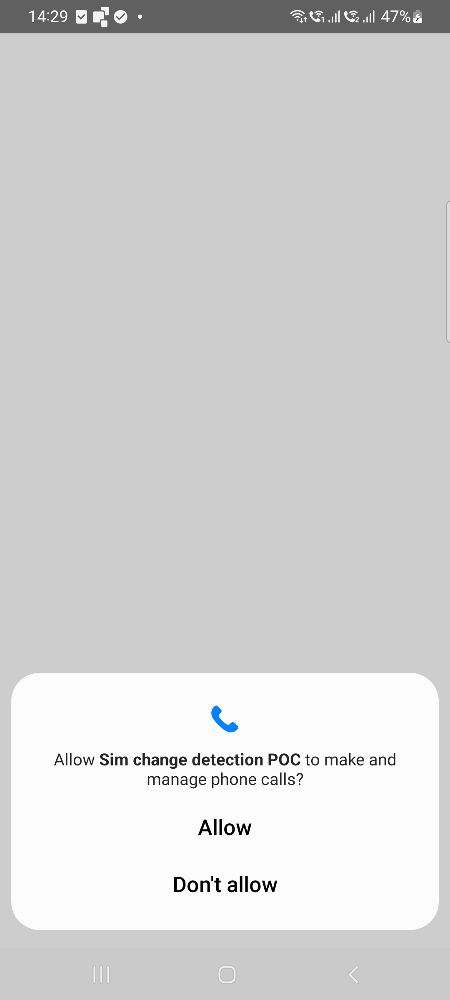
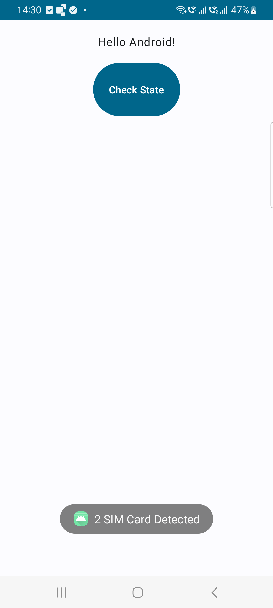
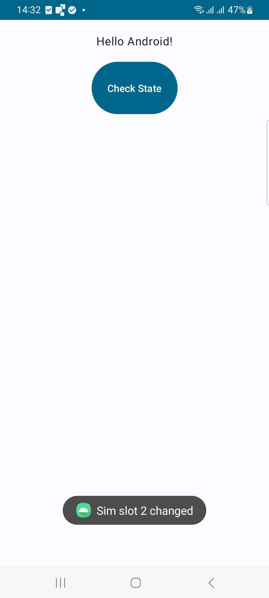

# SIM Change Detector for Android

This Android Kotlin application is designed to detect SIM card changes in your mobile device, supporting multiple SIM cards. It provides a interface with a "Check State" button to verify if the SIM card in a slot has been changed. If a change is detected, it will display a message indicating which SIM slot has changed.

## Features

* Detect SIM card changes in your mobile device.
* Supports multiple SIM cards.
* Simple interface.
* Uses SharedPreferences to save SIM card states for comparison.

## Screenshots

<p float="left">
  


</p>

<br>

## 1. Permissions

Ensure that you have the necessary permissions in your AndroidManifest.xml file to receive SIM state change broadcasts:

```
<receiver android:name=".SimChangeReceivers"
    android:enabled="true"
    android:exported="true">
    <intent-filter>
        <action android:name="android.intent.action.SIM_STATE_CHANGED"/>
    </intent-filter>
</receiver>
```

## 2. SimChangeReceivers.kt

This class ```SimChangeReceivers.kt``` is responsible for receiving SIM state change broadcasts and displaying a toast notification. It extracts the SIM state from the broadcast intent.

```
class SimChangeReceivers: BroadcastReceiver() {
    private val TAG = "SimChangeReceivers"

    override fun onReceive(context: Context?, intent: Intent?) {
        var state = ""
        if (intent != null) {
            state = intent.extras?.getString("ss").toString()
        }
        Log.i(TAG, "SIM State Change Detected $state") // State can be ABSENT | READY | LOADED

        Toast.makeText(context, "Broadcast SIM State Change Detected - $state", Toast.LENGTH_SHORT).show()
    }
}

```

## 3. MainActivity.kt

The ```MainActivity.kt``` class initializes SharedPreferences, displays the user interface, saves the SIM card state, and provides a "Check State" button to check if the SIM card has changed.

<br>

## How to Use

* Build and run the application on your Android device.

* When the application starts, it will save the current SIM card state using SharedPreferences.

* Click the "Check State" button to verify if the SIM card in a slot has changed.

* If a change is detected, a message will be displayed indicating which SIM slot has changed (e.g., "Sim slot (1 or 2) changed").

<br>

## Contributing

Contributions are welcome! If you have any improvements or bug fixes, please submit a pull request.

## License

This project is licensed under the MIT License - see the [LICENSE](https://choosealicense.com/licenses/mit/) file for details.

## Acknowledgments

Special thanks to the Android developer community for their support and contributions.

<br>

## Contact

If you have any questions or need further assistance, feel free to contact the project owner:

Ali Haider

<alihaider78222@gmail.com>

<https://github.com/alihaider78222>